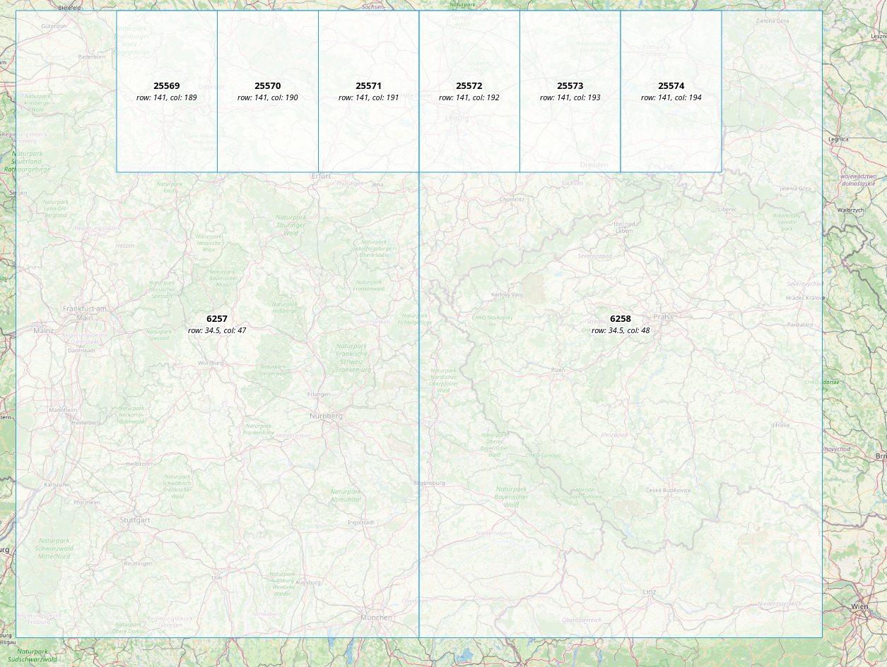

# Valhalla: Pull Tiles over HTTP

Tiny example that shows how to use a static file server for pulling in missing tiles as needed.
Does not work with the tar extract, but you can gzip the individual tiles on the file server and use `mjolnir.tile_url_gz` on the service side to request the gzipped files.

## Setup

### Build tiles

```sh
docker compose up valhalla_build_tiles
```

### Spin up Valhalla and File Server

```sh
docker compose up -d
```

Check that the `tile_dir` mapped to Valhalla's service is empty:

```sh
ll service_data/tiles
```

Run a small route request:

```sh
curl --request POST \
  --url http://localhost:8002/route \
  --header 'Content-Type: application/json' \
  --data '{
	"locations": [
		{
			"lon": 6.711466,
			"lat": 0.374734
		},
		{
                        "lon": 6.708205,
                        "lat": 0.372299
                      }
	],
	"costing": "auto"
}'
```

You should get a valid route response. Now check again for the service's `tile_dir` and you'll see the needed tiles.

## What to look out for when configuring Valhalla like this

- the parameter `mjolnir.tile_url` should contain the string `{tilePath}`, which Valhalla will replace with the relative path to the tile (see below on how tile paths work)
- set `loki.use_connectivity` to false

## An excursion in Tile Paths

Valhalla stores tiles in a hierarchical file structure. Most of this is abstracted away from the end user,
because you just point Valhalla to a directory to build tiles to and read from and it will manually resolve
relative paths within that directory itself when reading/writing.

Valhalla splits the world into hierarchical tiles. By default, there are three levels (level 0
contains highways, motorways, etc.; level 1 contains arterial roads; level 2 contains all other roads,
bike paths, footways, and so on). Each level has its own tile size:

- level 0: 4° across latitude and longitude
- level 1: 1° across latitude and longitude
- level 2: 0.25° across latitude and longitude

Each tile has an identifier (so do edges and nodes, but more on that further down), which is the index into
the row-major 2-dimensional array of tiles on a given level. Indices start at the bottom left corner, so the
bottom-left corner coordinate of the 0th tile is always -180° longitude, -90° latitude. Here's an example
showing tile IDs and their row/column for a small sample of tiles on levels 0 and 1 in Germany:



Using this ID, we can construct a relative path to a tile. In order to limit the max number of objects
to 1000, we have to have some more hierarchical structuring. So the tile with ID 6258 at level 1 will be located at
`tileDir/1/000/006/258.gph`, and tile with ID 267571 at level 2 at `tileDir/2/000/267/571.gph`.

What's more about this ID system is that edges and nodes inherit the level and base tile ID from the tile they are in,
just adding a local index to it, which also functions as an offset into the lists of nodes/edges within the
tile. So e.g. the 3rd edge in the tile with ID 6258 at level 1 will have the ID `level=1,tile=6258,id=3`,
which are internally represented in 46 bits to save storage.

For more reading on tiles and the identifier system, see [here](https://valhalla.github.io/valhalla/tiles/).
